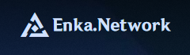

# enkaNetwork

> Node JS/TypeScript module that allows you to work with the site API [enka.network](https://enka.network/) adding localization and convenience (even caching).

<div align='center'>
   
</div>

<div align='center'>
  <a href='https://github.com/kravetsone/enkaNetwork/tree/main/examples'><b>examples</b></a>
  <span>&nbsp;•&nbsp;</span>
  <a href='#-response-structure'><b>structure</b></a>
</div>
<br>
<div align='center'>
   
   
   
   
   
</div>

## 📦 Download

- **usage `npm`**
  ```shell
  npm i enkanetwork
  ```
- **usage `Yarn`**
  ```shell
  yarn add enkanetwork
  ```

# 🛠️ Usage

```js
import { EnkaNetwork } from "enkanetwork"; //const { EnkaNetwork } = require("enkanetwork");
const enka = new EnkaNetwork({ language: "EN", caching: true });
```

| Key       | In API | Type              | Description                                                                                           | Required? |
| --------- | ------ | ----------------- | ----------------------------------------------------------------------------------------------------- | --------- |
| language  | -      | number            | The language to be used in the localization of names (characters, artifacts, etc.). Default is «`EN`» | -         |
| caching   | -      | boolean           | Cache responses? Default is `true`                                                                    | -         |
| userAgent | -      | string or boolean | Disable or change the header `User-Agent`. (`false` for disable)                                      | -         |

## Fetch user with characters by uid from the game (response is [FetchUserUID](#fetchuseruid))

```js
const user = await enka.fetchUser(700832641, "RU");
```

| Key      | In API | Type   | Description                                                                                                                      | Required? |
| -------- | ------ | ------ | -------------------------------------------------------------------------------------------------------------------------------- | --------- |
| UID      | -      | number | `UID` from the game                                                                                                              | +         |
| language | -      | number | The language to be used in the localization of names (characters, artifacts, etc.). Default is [EnkaNetwork.language](#🛠️-usage) | -         |

## Fetch playerInfo by uid from the game (response is [FetchPlayerInfo](#fetchplayerinfo))

```js
const user = await enka.fetchPlayerInfo(700832641, "RU");
```

| Key      | In API | Type   | Description                                                                                                                      | Required? |
| -------- | ------ | ------ | -------------------------------------------------------------------------------------------------------------------------------- | --------- |
| UID      | -      | number | `UID` from the game                                                                                                              | +         |
| language | -      | number | The language to be used in the localization of names (characters, artifacts, etc.). Default is [EnkaNetwork.language](#🛠️-usage) | -         |

## Or fetch user by enka profile tag (response is [FetchUserProfile](#fetchuserprofile))

```js
const user = await enka.fetchProfile("Algoinde", "RU");
```

| Key         | In API | Type   | Description                                                                                                                      | Required? |
| ----------- | ------ | ------ | -------------------------------------------------------------------------------------------------------------------------------- | --------- |
| Profile tag | -      | string | Enka patreon `profile tag` from the [site EnkaNetwork](https://enka.network/)                                                    | +         |
| language    | -      | number | The language to be used in the localization of names (characters, artifacts, etc.). Default is [EnkaNetwork.language](#🛠️-usage) | -         |

## Or fetch user by enka profile tag (response is [FetchUserProfile](#fetchuserprofile) or array of [FetchUserProfile](#fetchuserprofile))

```js
const accounts = await enka.fetchProfileAccounts("Algoinde", "RU");
//or
const account = await enka.fetchProfileAccount("Algoinde", "4Wjv2e", "RU");
```

| Key              | In API | Type   | Description                                                                                                                      | Required? |
| ---------------- | ------ | ------ | -------------------------------------------------------------------------------------------------------------------------------- | --------- |
| Profile username | -      | string | Enka `profile username` from the [site EnkaNetwork](https://enka.network/)                                                       | +         |
| Account hash     | -      | string | Enka `account hash` from an account on the [site EnkaNetwork](https://enka.network/) (only for `fetchProfileAccount`)            | +-        |
| language         | -      | number | The language to be used in the localization of names (characters, artifacts, etc.). Default is [EnkaNetwork.language](#🛠️-usage) | -         |

# ⚙ Response structure

## FetchUserUID

| Key        | In API         | Type   | Description                    |
| ---------- | -------------- | ------ | ------------------------------ |
| player     | playerInfo     | object | See [Player](#player)          |
| characters | avatarInfoList | array  | See [Characters](#characters)  |
| ttl        | ttl            | number | Cache lifetime in milliseconds |

## FetchPlayerInfo

| Key    | In API     | Type   | Description                    |
| ------ | ---------- | ------ | ------------------------------ |
| player | playerInfo | object | See [Player](#player)          |
| owner  | owner      | object | See [Owner](#owner)            |
| ttl    | ttl        | number | Cache lifetime in milliseconds |

## FetchUserProfile

| Key         | In API               | Type   | Description                  |
| ----------- | -------------------- | ------ | ---------------------------- |
| username    | username             | string | Profile username             |
| bio         | profile.bio          | string | Profile bio                  |
| level       | profile.level        | number | Profile patreon level        |
| signupState | profile.signup_state | number | Profile username is verifed? |
| imageUrl    | profile.image_url    | string | Profile url of image         |

## FetchProfileAccount

| Key       | In API      | Type    | Description           |
| --------- | ----------- | ------- | --------------------- |
| uidPublic | uid_public  | boolean | Uid is public?        |
| public    | public      | boolean | Profile is public?    |
| verified  | verified    | boolean | Profile is verifed?   |
| player    | player_info | object  | See [Player](#player) |
| hash      | hash        | string  | Account  |
| region    | region      | string  | Profile url of image  |
| order     | order       | number  | Profile url of image  |

## FetchAccounts[]

| Key      | In API | Type  | Description                                   |
| -------- | ------ | ----- | --------------------------------------------- |
| -------- | -----  | array | See [Accounts](#accounts). Response is array. |

## Accounts

| Key           | In API        | Type    | Description           |
| ------------- | ------------- | ------- | --------------------- |
| is_uid_public | is_uid_public | boolean | User uid is public?   |
| player        | player_info   | object  | See [Player](#player) |

## EnkaProfile

| Key         | In API               | Type     | Description                 |
| ----------- | -------------------- | -------- | --------------------------- |
| id          | id                   | string   | Enka profile id             |
| username    | profile.username     | string   | Enka profile username       |
| bio         | profile.bio          | string   | Enka profile description    |
| level       | profile.level        | number   | Enka profile level          |
| drawName    | profile.draw_name    | booolean | Enka profile draw name?     |
| drawUid     | profile.draw_uid     | booolean | Enka profile draw uid?      |
| signupState | profile.signup_state | integer  | Enka profile sign up state  |
| imageUrl    | profile.image_url    | string   | Url of enka profile picture |

## Owner

| Key      | In API   | Type   | Description             |
| -------- | -------- | ------ | ----------------------- |
| hash     | hash     | string | Enka profile hash       |
| username | username | string | Enka profile username   |
| profile  | profile  | object | See [Profile](#profile) |

## Profile

| Key         | In API               | Type    | Description                 |
| ----------- | -------------------- | ------- | --------------------------- |
| signupState | profile.signup_state | integer | Enka profile sign up state  |
| imageUrl    | profile.image_url    | string  | Url of enka profile picture |

## Player

| Key               | In API               | Type   | Description                                      |
| ----------------- | -------------------- | ------ | ------------------------------------------------ |
| nickname          | nickname             | string | Profile nickname                                 |
| signature         | signature            | string | Profile description                              |
| level             | level                | number | User rank level                                  |
| worldLevel        | worldLevel           | number | User world level                                 |
| nameCard          | -                    | object | See [NameCard](#namecard)                        |
| achievements      | finishAchievementNum | number | Achievements count                               |
| abyssFloor        | towerFloorIndex      | number | The floor of the abyss passed by the player      |
| abyssLevel        | towerLevelIndex      | number | The hall of the abyss floor passed by the player |
| charactersPreview | showAvatarInfoList   | array  | See [CharacterPreview](#characterpreview)        |
| nameCardsPreview  | showNameCardIdList   | array  | See [NameCard](#namecard)                        |
| profilePicture    | profilePicture       | object | See [ProfilePicture](#profilepicture)            |

### NameCard

| Key    | In API     | Type   | Description                |
| ------ | ---------- | ------ | -------------------------- |
| id     | nameCardId | number | Namecard id                |
| name   | -          | string | Localized namecard name    |
| icon   | -          | string | URL to get the icon        |
| banner | -          | string | URL to get the icon banner |
| navbar | -          | string | URL to get the icon navbar |

### CharacterPreview

| Key   | In API   | Type   | Description                   |
| ----- | -------- | ------ | ----------------------------- |
| id    | avatarId | number | Character id                  |
| name  | -        | string | Localized character name      |
| icon  | -        | string | URL to get the character icon |
| level | level    | number | Character level               |

### ProfilePicture

| Key  | In API   | Type   | Description                   |
| ---- | -------- | ------ | ----------------------------- |
| id   | avatarId | number | Character id                  |
| name | -        | string | Localized character name      |
| icon | -        | string | URL to get the character icon |

## Characters

| Key           | In API                 | Type   | Description                                           |
| ------------- | ---------------------- | ------ | ----------------------------------------------------- |
| id            | avatarId               | number | Character id                                          |
| name          | -                      | string | Localized character name                              |
| icons         | -                      | object | See [Icons](#icons)                                   |
| rarity        | -                      | number | Character rarity (5 or 4)                             |
| element       | -                      | string | See [ElementType](#elementtype)                       |
| level         | propMap["4001"]        | number | Character level                                       |
| elevations    | propMap["1002"]        | number | Character elevations                                  |
| xp            | propMap["1001"]        | number | Character expiriance                                  |
| constellation | talents                | array  | See [CharacterConstellation](#characterconstellation) |
| skills        | skills                 | array  | See [CharacterSkill](#characterskill)                 |
| skillSetId    | skillDepotId           | number | Character Skill Set ID                                |
| skillData     | inherentProudSkillList | array  | List of Unlocked Skill Ids                            |
| stats         | fightPropMap           | array  | Character stats                                       |
| weapon        | equipList              | number | See [CharacterWeapon](#characterweapon)               |
| reluquary     | equipList              | number | See [ProfilePicture](#profilepicture)                 |

### Icons

| Key    | In API | Type   | Description                |
| ------ | ------ | ------ | -------------------------- |
| avatar | -      | string | Character avatar icon      |
| side   | -      | string | Character side avatar icon |

### ElementType

| Key     | In API   |
| ------- | -------- |
| Cryo    | Ice      |
| Hydro   | Water    |
| Anemo   | Wind     |
| Pyro    | Fire     |
| Geo     | Rock     |
| Electro | Electric |

### CharacterConstellation

| Key      | In API | Type    | Description                                 |
| -------- | ------ | ------- | ------------------------------------------- |
| id       | talent | number  | Character constellation id                  |
| name     | -      | string  | Character constellation name                |
| icon     | -      | string  | URL to get the character constellation icon |
| unlocked | -      | boolean | Character constellation unlocked?           |

### CharacterSkill

| Key   | In API | Type   | Description                         |
| ----- | ------ | ------ | ----------------------------------- |
| id    | skill  | number | Character skill id                  |
| name  | -      | string | Character skill name                |
| icon  | -      | string | URL to get the character skill icon |
| level | level  | number | Character skill level               |

### CharacterWeapon

| Key         | In API              | Type   | Description                          |
| ----------- | ------------------- | ------ | ------------------------------------ |
| id          | itemId              | number | Character weapon id                  |
| name        | -                   | string | Character weapon name                |
| icon        | -                   | string | URL to get the character weapon icon |
| level       | level               | number | Character weapon level               |
| elevations  | weapon.promoteLevel | number | Character weapon elevations          |
| improvement | weapon.affixMap     | number | Character weapon improvement         |
| rarity      | flat.rankLevel      | number | Character weapon rarity              |
| mainStat    | flat.weaponStats[0] | object | Character weapon main stat           |
| subStat     | flat.weaponStats[1] | object | Character weapon sub stat            |

### CharacterReluquary

| Key      | In API                 | Type   | Description                              |
| -------- | ---------------------- | ------ | ---------------------------------------- |
| id       | itemId                 | number | Character reluquary id                   |
| name     | -                      | string | Character reluquary name                 |
| setName  | -                      | string | Character reluquary set name             |
| icon     | -                      | string | URL to get the character reluquary icon  |
| type     | -                      | string | See [ReliquaryType](#characterreluquary) |
| level    | reliquary.level        | number | Character reluquary level                |
| rarity   | flat.rankLevel         | number | Character reluquary rarity               |
| mainStat | flat.reliquaryMainstat | object | Character reluquary main stat            |
| subStat  | flat.reliquarySubstats | object | Character reluquary sub stat             |

### ReliquaryType

| Key     | In API         |
| ------- | -------------- |
| Flower  | EQUIP_BRACER   |
| Feather | EQUIP_NECKLACE |
| Sands   | EQUIP_SHOES    |
| Goblet  | EQUIP_RING     |
| Circlet | EQUIP_DRESS    |

For assets thanks [enkanetwork.py-data](https://github.com/mrwan200/enkanetwork.py-data/)
